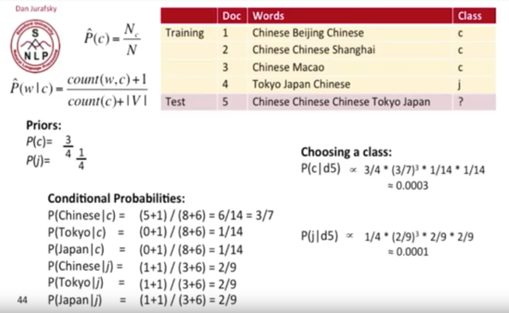

# rust-bn

<a href="https://travis-ci.org/liufuyang/rust-nb"></a>

A simple Naive Bayes Model in Rust

## How To Use

WIP

```rust
fn main() {

}
```

## About Naive Bayes Model (and how to understand the code)

Firstly let's take a look at the Bayes equations for only 2 classes and a feature

<a href="https://www.codecogs.com/eqnedit.php?latex=p(c_1&space;|&space;x)&space;=&space;\frac{&space;p(x&space;|&space;c_1)&space;p(c_1)&space;}{&space;p(x&space;|&space;c_1)&space;p(c_1)&space;&plus;&space;p(x&space;|&space;c_2)&space;p(c_2)}" target="_blank"></a>

<a href="https://www.codecogs.com/eqnedit.php?latex=p(c_2&space;|&space;x)&space;=&space;\frac{&space;p(x&space;|&space;c_2)&space;p(c_2)&space;}{&space;p(x&space;|&space;c_1)&space;p(c_1)&space;&plus;&space;p(x&space;|&space;c_2)&space;p(c_2)}" target="_blank"></a>

As we can see the denominator is same for both probabilities of class 1 and 2 based on input x (and they sum equal to 1).

Thus we could simply only focusing calculating only the numerator part for each classes then normalized them all in the end
to get probabilities for each class prediction.

This also generalize to the classes number greater than 2 as well.

<a href="https://www.codecogs.com/eqnedit.php?latex=p(c_n&space;|&space;x)&space;<=&space;{&space;p(x&space;|&space;c_n)&space;p(c_n)&space;}" target="_blank"></a>

Note here we use `<=` notation meaning we can infer `p(c_n | x)` by the value on the right later on, after we have all 
calculations of classes with number index as `n.

Now expand this to situations where we have multiple features, index of features noted with `i`, and let `X = x_1, x_2, ... x_i`,
we have:

<a href="https://www.codecogs.com/eqnedit.php?latex=p(c_n&space;|&space;X)&space;<=&space;{&space;p(X&space;|&space;c_n)&space;p(c_n)&space;}" target="_blank"></a>

<a href="https://www.codecogs.com/eqnedit.php?latex=p(c_n&space;|&space;X)&space;<=&space;{&space;p(x_1,&space;x_2,&space;...&space;x_i&space;|&space;c_n)&space;p(c_n)&space;}" target="_blank"></a>

As "Naive" way of thinking, each feature appearance x_i is independent, so we could have:

<a href="https://www.codecogs.com/eqnedit.php?latex=p(c_n&space;|&space;X)&space;<=&space;p(c_n)&space;\:&space;p(x_1|&space;c_n)&space;\,&space;p(x_2|&space;c_n)&space;\,&space;p(x_3|&space;c_n)&space;\,...\,&space;p(x_i&space;|&space;c_n)" target="_blank"></a>

## Feature type: Multinomial and Categorical

Currently we support two feature type:
* Categorical: each x_i in above equations are different value
* Multinomial (a.k.a Text feature): each x_i in above equations could be the same. For example, in the case of counting words to predict document class,
a word `apple` as `x_i` can appear multiple times, let's denote it as `t_i` (as in code it's called `inputFeatureCounts`.)

One can also think of `Categorical` feature being as `Multinomial` feature but all `t_i` is 1. 

So we for now just look at equations for `Multinomial`. Suppose now our `x_i` as unique words, the equations becomes as:

<a href="https://www.codecogs.com/eqnedit.php?latex=p(c_n&space;|&space;X)&space;<=&space;p(c_n)&space;\:&space;p(x_1|&space;c_n)^{t_1}&space;\,&space;p(x_2|&space;c_n)^{t_2}&space;\,&space;p(x_3|&space;c_n)^{t_3}&space;\,...\,&space;p(x_i&space;|&space;c_n)&space;^{t_i}" target="_blank"></a>

There are many multiplications with values less than one. To prevent the number gets to small to be presented as double 
in computers, we can calculate the log value on each side instead:

<a href="https://www.codecogs.com/eqnedit.php?latex=log(p(c_n&space;|&space;X))&space;<=&space;log(&space;p(c_n))&space;&plus;&space;\:&space;t_1&space;log(&space;p(x_1|&space;c_n))&space;&plus;&space;\:&space;t_2&space;log(p(x_2|&space;c_n))&space;&plus;&space;\:&space;t_3&space;log(&space;p(x_3|&space;c_n))&space;\,...\,&space;&plus;&space;\:&space;t_i&space;log(p(x_i&space;|&space;c_n)&space;)" target="_blank"></a>

or

<a href="https://www.codecogs.com/eqnedit.php?latex=log(p(c_n&space;|&space;X))&space;<=&space;log(&space;p(c_n))&space;&plus;&space;\:&space;\sum_{i}&space;t_i&space;log(p(x_i|&space;c_n))" target="_blank"></a>

To calculate the priors `p(c_n|X)` and conditional probabilities `p(x_i| c_n)`:

<a href="https://www.codecogs.com/eqnedit.php?latex=p(c_n)&space;=&space;\frac{N_{c_n}}{N}&space;,\:&space;\:&space;p(x_i|&space;c_n)&space;=&space;\frac{count(x_i,&space;c_n)&space;&plus;&space;\epsilon&space;}{count(c_n)&space;&plus;&space;|V|&space;*&space;\epsilon&space;}" target="_blank"></a>

<a href="https://www.codecogs.com/eqnedit.php?latex=\begin{align*}&space;log(p(c_n&space;|&space;X))&space;<=&space;\:&space;&&space;log(&space;N_{c_n})&space;-&space;log(N)&space;&plus;\\&space;&&space;\sum_{i}&space;t_i&space;(log(count(x_i,&space;c_n)&space;&plus;&space;\epsilon)&space;-&space;log(count(c_n)&space;&plus;&space;|V|&space;*&space;\epsilon))&space;\end{align*}" target="_blank"></a>

So in the end we have those things need to calculate during training and predicting:
* During Training and Predicting, save or access these parameters:
    * `N_cn` : prior count of class c_n. Calculated via function `logPrior` in code.
    * `N`: sum of all prior count `N_cn` of all class c_n. Calculated via function `logPrior` in code.
    * `count(x_i, c_n)`: count of word/feature i's appearance in class c_n `countFeatureAppearsInOutcome`
    * `count(c_n)`: count of total numbers of word/feature appeared in class c_n `totalFeatureCountInOutcome`
    * `|V|`: count of the unique words/feature/vocabulary among all classes. In code it is called `numOfUniqueFeaturesSeen`
* Only During Predicting, also calculate:
    * `t_i`: number of time word/feature i appears in the incoming data for prediction. In code it is called `inputFeatureCounts`
* Constant:
    * `epsilon`: pseudocount, no probability is ever set to be exactly zero. By default we set it as 1, This way of regularizing naive Bayes is called Laplace smoothing when the pseudocount is one

